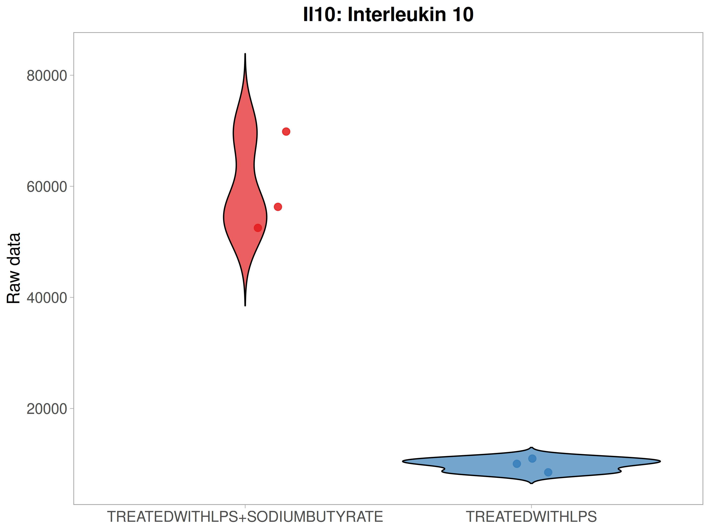
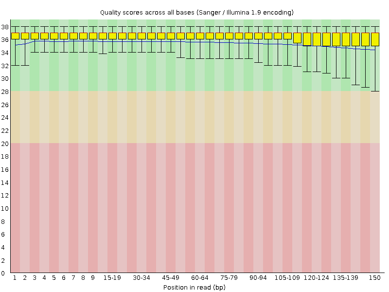
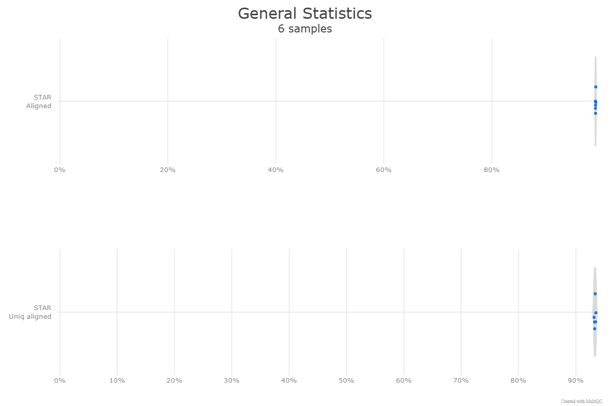
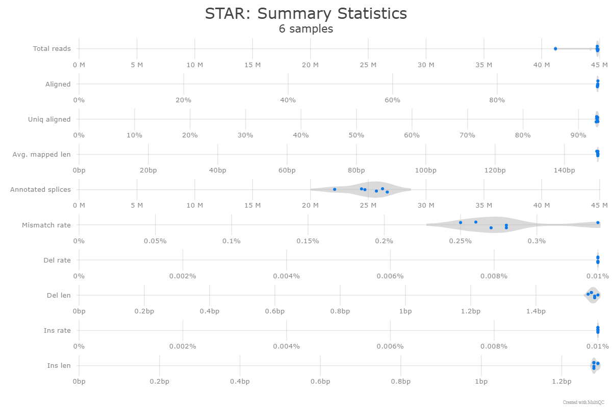
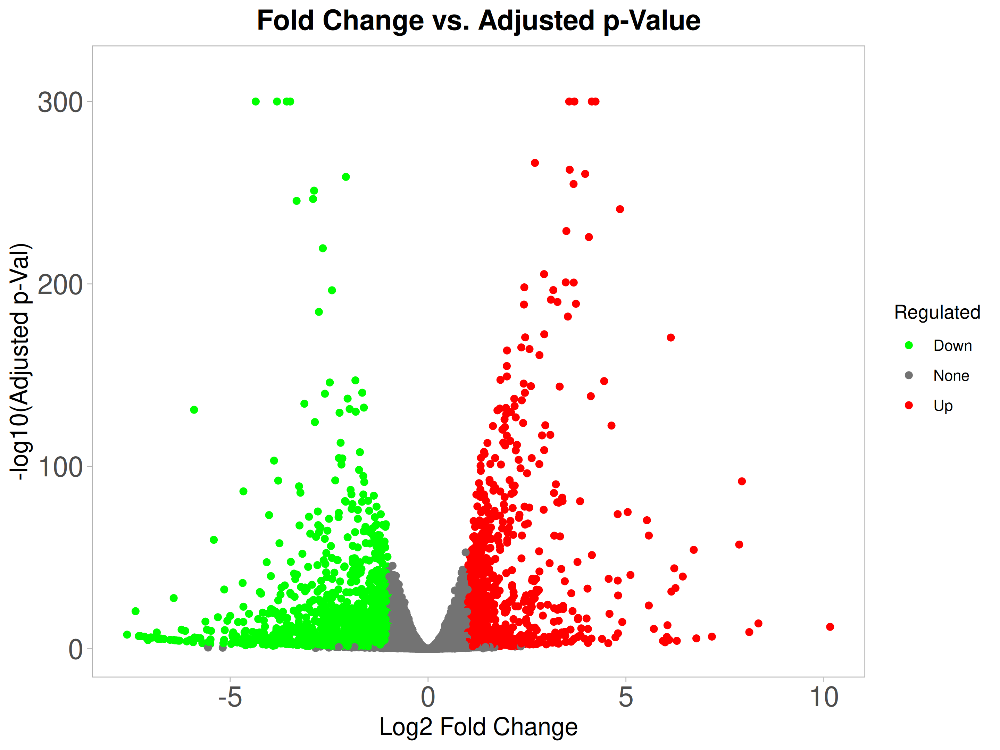
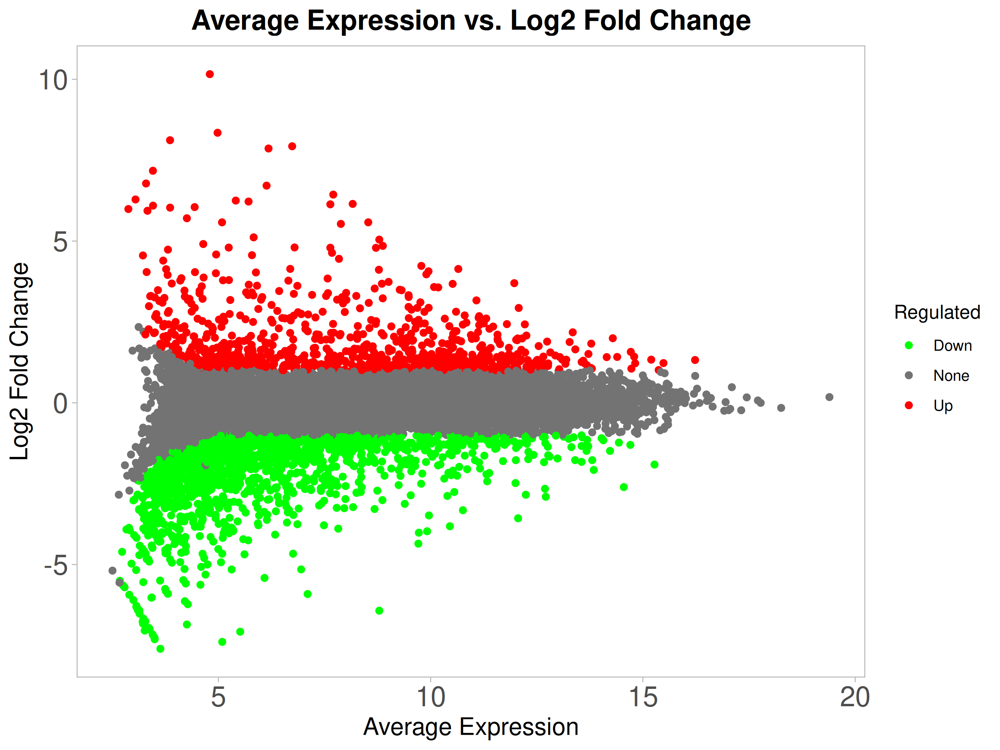

# 🧬 Epigenetic Reprogramming of B Cells by Sodium Butyrate

## 1. Background and Biological Significance

### 1.1 The Problem: Chronic Inflammation and Antibody-Mediated Autoimmunity

Lipopolysaccharide (LPS) activation of B cells represents a classical model of innate immune stimulation that triggers excessive pro-inflammatory cytokine production and pathogenic antibody generation. In autoimmune diseases, sepsis, and chronic inflammation, LPS-induced B cell activation leads to:

- **Cytokine Storm:** Excessive $IL-6$ and $TNF-\alpha$ production.

- **Interferon Responses:** Enhanced $IFN-\alpha/\beta$ driving autoimmunity.

- **Pathogenic Signaling:** Hyperactivated BCR and TLR4 signaling via the **MyD88-dependent NF-κB cascade**.

- **Loss of Tolerance:** Class switching to autoantibody-producing plasma cells and reduced **B10 (IL-10+)** regulatory function.

Traditional immunosuppressive approaches (corticosteroids, TNF inhibitors) often fail to restore immune balance. There is a critical need for strategies that reprogram activated B cells toward a regulatory phenotype.

***

### 1.2 The Potential Solution: Sodium Butyrate as an Epigenetic Immunomodulator

Sodium butyrate (NaB) is a short-chain fatty acid (SCFA) produced by gut microbiota that acts as a potent **Histone Deacetylase (HDAC) inhibitor**.

- **Epigenetic Mechanism:** By inhibiting Class I and II HDACs, butyrate prevents the deacetylation of lysine residues on histone tails, maintaining a relaxed, transcriptionally active **euchromatin** structure.

- **Targeted Action:** BioProject **PRJNA698992** investigates the hypothesis that this relaxation is targeted to specific regulatory loci.

- **Dual Mechanism:** NaB engages specific kinase pathways—notably **p38 MAPK**—to drive the transcriptional machinery required for $IL-10$ production.

***

### 1.3 Critical Questions Addressed

- \[x] Which specific genes are dysregulated by NaB + LPS?

- \[x] Are changes primarily in innate (TLR/NF-κB) or adaptive (JAK-STAT) pathways?

- \[x] What is the relative magnitude of $IL-10$ (regulatory) vs. $IL-6$ (pro-inflammatory)?

- \[x] Does butyrate selectively attenuate or globally suppress inflammatory pathways?

***

## 2. Study Design & Experimental Strategy

| **Feature**               | **Description**                             |
| ------------------------- | ------------------------------------------- |
| **Model**                 | CD19+ B cells from Spleens of C57BL/6 Mice  |
| **Condition 1 (Control)** | LPS (10 μg/ml) - Pro-inflammatory phenotype |
| **Condition 2 (Exp)**     | LPS (10 μg/ml) + Sodium Butyrate (0.5 mM)   |
| **Replicates**            | $n=6$ (3 replicates per condition)          |
| **Analysis**              | RNA-seq Differential Expression (DESeq2)    |
| **Thresholds**            | $padj < 0.05$; $                            |

***

## 3. Key Findings

### 🚀 Finding 1: Massive IL-10 Upregulation

- **Log2FC:** $+2.606$ (6-fold increase)

- **P-value:** $1.52 \times 10^{-140}$

- **Significance:** The most statistically significant gene in the entire transcriptome, defining the **B10 regulatory phenotype**.

### 🛑 Finding 2: Robust IL-6 Suppression

- **Log2FC:** $-4.137$ (18-fold decrease)

- **P-value:** $1.80 \times 10^{-303}$

- **Significance:** Near-complete shutdown of the primary NF-κB pro-inflammatory output.
.png)

### ⚖️ Finding 3: JAK-STAT Pathway Reprogramming

- **Activation:** $JAK2$ ($+1.663$) and $STAT5a/b$ ($+0.9$) activation drives the regulatory axis.

- **Suppression:** $STAT1/2$ ($-2.2/-1.9$) suppression ablate Type I interferon responses.

### ❄️ Finding 4: Interferon Response Shutdown

- **Marker:** $Ifi44$ ($-10.159$ Log2FC) is almost completely silenced.

- **Result:** Autoimmune-driving Type I IFN responses are eliminated.

***
.png)

## 4. The Central Hypothesis

<!---->

<!---->

<!---->

<!---->

<!---->

<!---->

<!---->

Code snippet

<!---->

<!---->

<!---->

<!---->

    graph TD
        A[Sodium Butyrate] --> B[HDAC3 Inhibition]
        B --> C[Selective Chromatin Remodeling]
        C --> D[JAK2-STAT5 Activation & STAT1/2 Suppression]
        D --> E[IL-10 High / IL-6 Low]
        E --> F[B10 Regulatory B Cell Phenotype]
        F --> G[Immune Tolerance]

<!---->

<!---->

<!---->

<!---->

<!---->

<!---->

<!---->

<!---->

<!---->

<!---->

<!---->

<!---->

<!---->

<!---->

<!---->

<!---->

<!---->

<!---->

<!---->

<!---->

<!---->

<!---->

<!---->

<!---->

<!---->

<!---->

<!---->

<!---->

<!---->

<!---->

<!---->

<!---->

<!---->

<!---->

<!---->

<!---->

<!---->

<!---->

<!---->

<!---->

<!---->

<!---->

<!---->

<!---->

<!---->

<!---->

<!---->

<!---->

<!---->

<!---->

<!---->

<!---->

<!---->

***

## 5. Computational Pipeline

### Stage 1: Data Acquisition

- **`prefetch`:** Efficiently downloads `.sra` archive files from NCBI.

- **`fasterq-dump`:** Extracts raw reads into FASTQ format.

  - _Note: Utilized `--temp` on a 100GB+ drive to accommodate large intermediate files._

### Stage 2: Quality Control & Pre-processing

- **QC:** `FastQC` and `MultiQC` used for per-base quality and adapter assessment.

- **`fastp` Processing:** All-in-one trimming and filtering.

  - `--thread 4`: Optimized for 16 GB RAM stability.

  - `--detect_adapter_for_pe`: Automatic Illumina adapter detection.

  - `--length_required 50`: Discards short reads to ensure alignment accuracy.

  - `--qualified_quality_phred 20`: High-confidence base filtering.

### Stage 3: Alignment (STAR)

- **Reference:** _Mus musculus_ (mm39) genome index.

- **Resource Constraints:** 16 GB RAM optimized via `--limitBAMsortRAM`.

- **Key Flags:**

  - `--runThreadN 4`: Multi-core parallelization.

  - `--genomeLoad NoSharedMemory`: Local workstation safety.

  - `--sjdbOverhang 100`: Optimized for 101 bp reads.

  - `--outSAMtype BAM SortedByCoordinate`: Memory-efficient output.

### Stage 4: Quantification (featureCounts)

Quantification performed on a 16 GB local system using the Subread package.

- **`-p`**: Paired-end fragment counting.

- **`-s 2`**: Reverse-stranded library specificity.

- **`-C`**: Merged single count matrix output for **DESeq2** readiness.

***

## 6. Sample Metadata

| **Sample ID**   | **Condition** | **Group** |
| --------------- | ------------- | --------- |
| **SRR13614803** | LPS           | Control   |
| **SRR13614804** | LPS           | Control   |
| **SRR13614805** | LPS           | Control   |
| **SRR13614806** | LPS + NaB     | Treated   |
| **SRR13614807** | LPS + NaB     | Treated   |
| **SRR13614808** | LPS + NaB     | Treated   |

***

 Differential expression analysis was performed using DESeq2 with an FDR cutoff of 0.05 and a minimum fold-change threshold of 2. Standard Wald test was used and independent filtering was enabled.
 
 
 .png)
